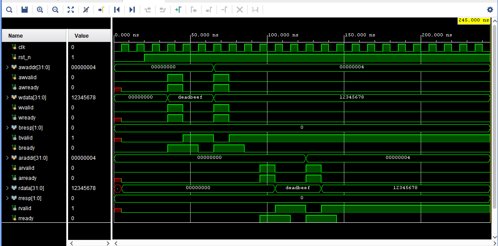

# AXI4-Lite Slave Peripheral (Verilog)

## Project Overview
This project implements a fully functional **AXI4-Lite Slave** interface in Verilog. 
The design is modular, synthesizable, and follows the AMBA AXI4-Lite protocol standard.

### Key Features:
* **4 Internal 32-bit Registers:** Decoded via `S_AXI_AWADDR` and `S_AXI_ARADDR`.
* **Full Handshake Logic:** Properly manages `VALID` and `READY` signals for all channels.
* **Synchronous Reset:** All registers initialized to `0x0` on `ARESETN`.
* **Standard Response Codes:** Returns `OKAY` (2'b00) for all transactions.

## Architecture
The core consists of two main state machines:
1. **Write Logic:** Handles Address (AW), Data (W), and Response (B) channels.
2. **Read Logic:** Handles Address (AR) and Data (R) channels.

## Simulation Results
Below is the simulation waveform from Vivado showing successful Write and Read transactions:

